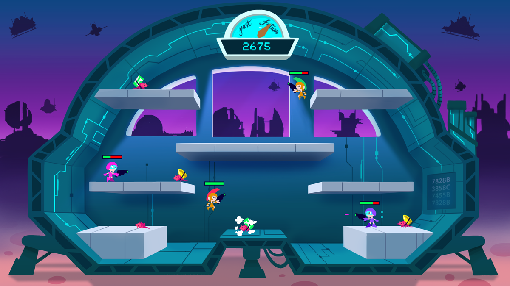
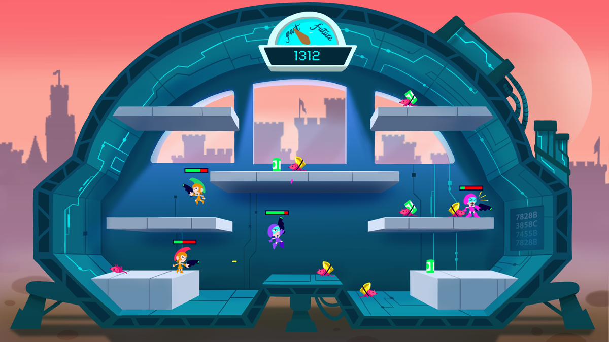
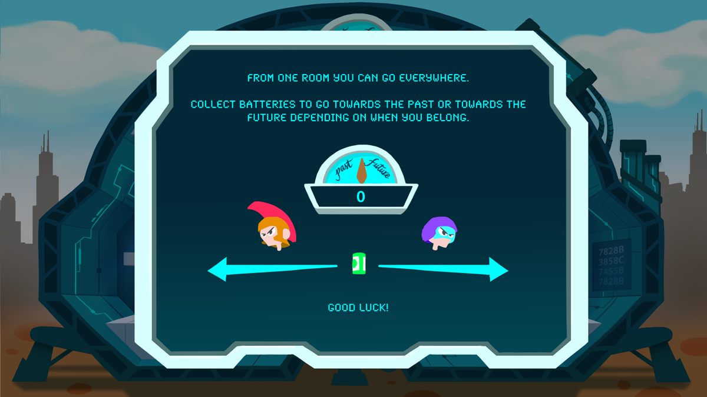

# Chrono Pugna
Ludum Dare 37 game entry. Local multiplayer 2D game for 2 to 4 players.
Theme: One Room

Time travellers find themselves inside a time machine and they want to get back home. Unfortunately they come from opposite times and the machine can only hold one teleport! Fight against the other team in order to go back to your time.

Pick up batteries being carried by rats that live inside the machinery before the other team in order to travel to your time.

## Controls
Default controls:

Player 1
 - w,a,s,d to move
 - c to shoot
 - f to kick
 - space to jump

Player 2
 - u, h, j, k to move 
 - l to shoot
 - p to kick
 - m to jump

 
 
** Note **
 - Controllers are supported, but need to be configured before the game
 - Players have 3 bullets each, powerups can be picked to shoot more

## Team
 - Giancarlo Dessena
 - Oriol Ribas
 - Sergio R. Lumley
 - Marta Viader

## Requirements
Uses Unity 5.5.0f3

### Known missing features
 - Current build works for only two players (future versions could hold 4 easily).
 - Sound is completely missing (time!)
 - Rats should damage you when they hit you
 - Amount of bullets left is not shown

  # Binaries for Download
 - [OSX](ReleaseVersion/pugna_1.0.0.zip)
 - Windows (hopefully soon)
