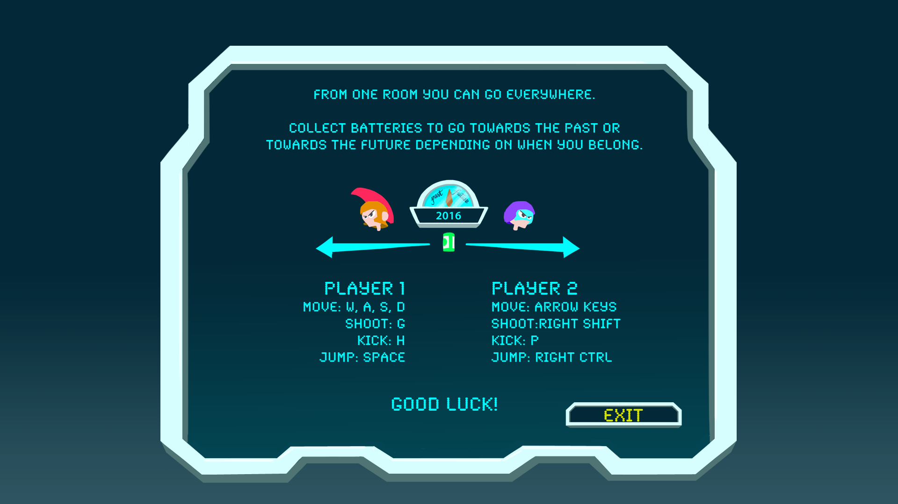

# Chrono Pugna
[Ludum Dare 37 game entry](http://ludumdare.com/compo/ludum-dare-37/?action=preview&uid=125037). Local multiplayer 2D game for 2 to 4 players.
Theme: One Room

Time travellers find themselves inside a time machine and they want to get back home. Unfortunately they come from opposite times and the machine can only hold one teleport! Fight against the other team in order to go back to your time.

Pick up batteries being carried by rats that live inside the machinery before the other team in order to travel to your time.

## Controls

It is *highly recommended* to play **with controller** when available. The game has been optimized for Xbox (360) controllers for both Windows and Mac (Linux should work too).

Default keyboard controls:

Player 1
 - w,a,s,d to move
 - g to shoot
 - h to kick
 - space to jump

Player 2
 - up, left, down, right arrow keys to move 
 - right shift to shoot
 - p to kick
 - right ctrl to jump

 

## Team
 - Giancarlo Dessena
 - Oriol Ribas
 - Sergio R. Lumley
 - Marta Viader

## Requirements
Uses Unity 5.5.0f3

### Known missing features
 - Current build works for only two players (future versions could hold 4 easily).
 - Rats should damage you when they hit you

## Binaries for Download
 - [Windows](ReleaseVersion/pugna_windows_1.0.0.zip)
 - [OSX](ReleaseVersion/pugna_1.0.0.zip)
 - [WebGL](https://pixelbumper.itch.io/chrono-pugna)